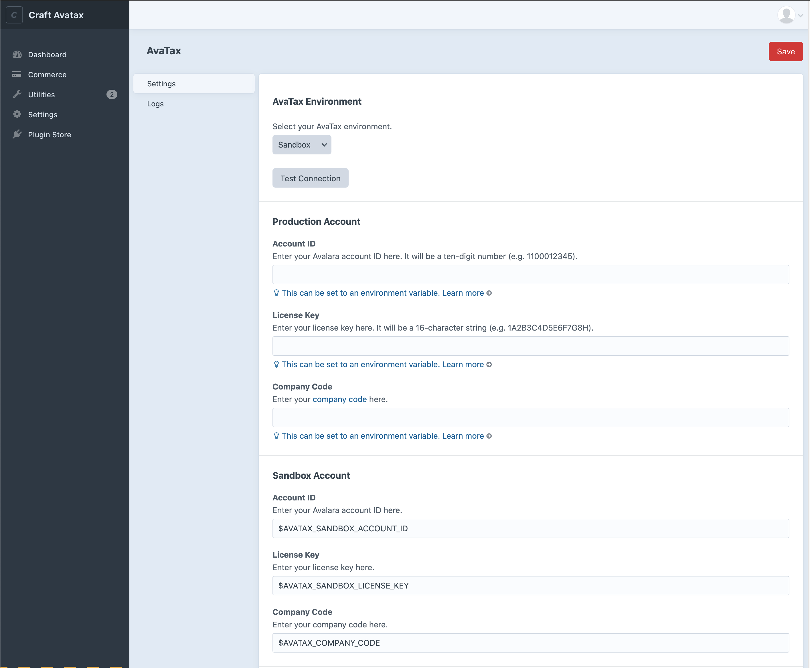
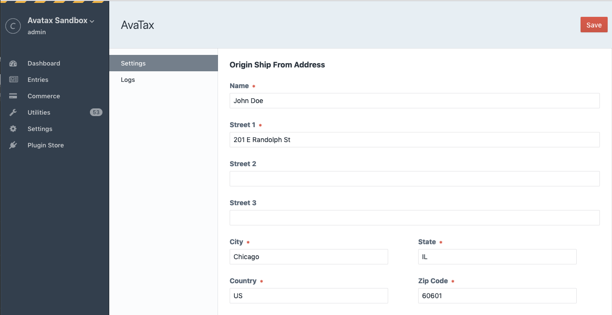
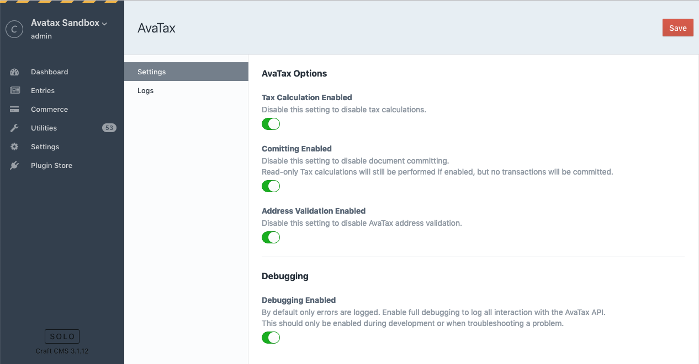
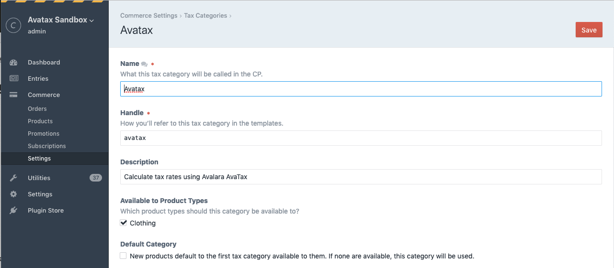
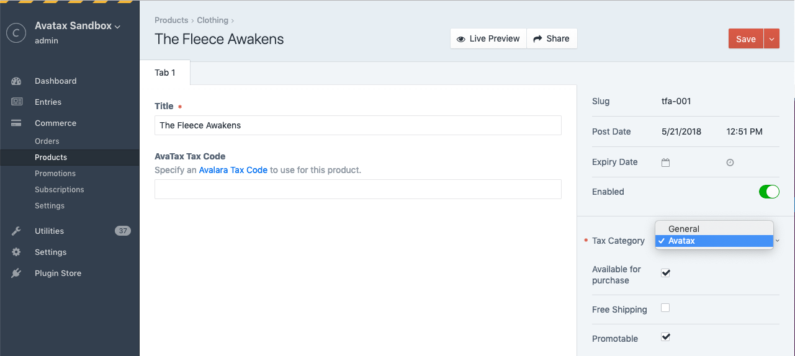
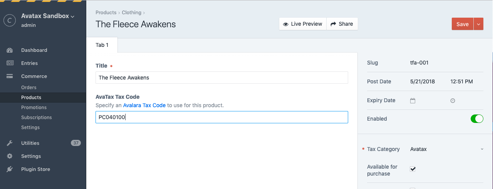

# Avatax plugin for Craft CMS 3.x

Calculate and add sales tax to an order's base tax using Avalara's AvaTax service.

<a href="https://help.avalara.com/001_Avalara_AvaTax/Find_Your_Home_Page/CraftCommerce_by_Surprise_Highway">
	
</a>

## Requirements

This plugin requires Craft CMS 3.1.0 or later and Craft Commerce 2.0 or later.

> Related: The Craft 2.x Commerce 1.x [version](https://github.com/surprisehighway/craft-avataxtaxadjuster) of this plugin is no longer actively maintained but is still supported.

## Installation

To install the plugin, follow these instructions.

1. Open your terminal and go to your Craft project:

        cd /path/to/project

2. Then tell Composer to load the plugin:

        composer require surprisehighway/craft-avatax

3. In the Control Panel, go to Settings → Plugins and click the “Install” button for Avatax.

## Setup Overview

Setup and configuration is detailed below, but here's a quick overview of what you'll need to do get started:

1. Configure the plugin settings with your Avalara account info and test the connection.
2. Configure the plugin settings with your origin address and default tax codes.
3. Set the "Avatax" tax category to be available to your product types.
4. Assign the "Avatax" tax category to your products.
4. Optionally add the product-specfic tax code field to your Product Type fields to allow per-product tax codes.
5. Optionally add the customer usage type field to your User fields to set up tax-exempt customers.

## Configuring AvaTax Account Connection

1. Visit the settings page at Settings → Avatax
2. Enter your the Account ID, License Key, and Company code credentials for each environment.
3. Selecting *Sandbox* or *Production* will enable the chosen environment.
4. Click the *Test Connection* button to verify your connection.
5. Click the *Save* button to save your settings.



## Configuring AvaTax Ship From Origin

1. Specify a valid origin address to ship from.
2. Click the *Save* button to save your settings.



## Configuring AvaTax Plugin Options

1. Visit the settings page at Settings → Avatax
2. *Tax Calculation Enabled* - enable or disable tax calculation independantly of other settings.
3. *Committing Enabled* - enable or disable document committing.
4. *Address Validation Enabled* - enable or disable Avalara's address verification.
5. *Debugging enabled* - while setting up and testing enable debugging to log all API interactions. Be sure to disable once live.
6. Click the *Save* button to save your settings.



## Using AvaTax

1. Visit Commerce → Settings → Tax Categories. A tax category with the handle "avatax" should exist, if not, create one.

	

2. Click the Avatax Tax Category. Check the product type(s) the Avalara Tax Rates will be available to.

	

After completing the installation and configuration, AvaTax will calculate and apply sales tax to all orders with a valid shipping address for products with the Avatax tax category selected.



## Tax Codes

*E.g. 'P0000000' - Tangible personal property (TPP)*.

You can set the default [Avalara Tax Code](https://taxcode.avatax.avalara.com/) by setting the Default Tax Code value in the plugin settings. This is the default tax code that will get sent to Avalara for all products.


You can also set a specific Tax Code for each product by adding a custom field to your Products.

#### To set up the product field:

1. Visit Settings → Fields. You should see a field named "AvaTax Tax Code" that was created during plugin installation. If not create, one. Note that the field "Name" can be anything you'd like, e.g. "AvaTax Tax Code" or "Product Tax Code", but the field "Handle" must match `avataxTaxCode` and is case sensitive.
2. Visit Commerce → Settings → Product Types and click the name of your Product Type.
2. Click the *Product Fields* tab.
3. Add the AvaTax Tax Code field and save.


In your product entries you can now enter any text to send along as the AvaTax Tax Code. If this field does not exist or is left empty the default tax code setting in your config file will be used.



> Hint: By default the field is plain text, but you could change it to a dropdown with pre-configured values for your use case as long as the handle stays the same.

## Shipping Codes

*E.g. 'FR' - Shipping Only - common carrier - FOB destination.*

Shipping charges are sent as a separate line item to AvaTax. You can set your default [Avalara Tax Code](https://taxcode.avatax.avalara.com/) for shipping charges by setting the Default Shipping Code in the plugin settings.


## Tax-Exempt Customers

You can specify a customer to be exempt from tax by adding a custom field to your User settings which is used to specify an [Avalara Entity/Use Code](https://help.avalara.com/000_Avalara_AvaTax/Exemption_Reason_Matrices_for_US_and_Canada).

#### To set up the User field:

1. Visit Settings → Fields. You should see a field named "AvaTax Customer Usage Type" that was created during plugin installation. If not create, one. Note that the field "Name" can be anything you'd like, e.g. "AvaTax Customer Usage Type" or "Entity/Use Code", but the field "Handle" must match `avataxCustomerUsageType` and is case sensitive.
2. Visit Settings → Users → Fields.
3. Add the AvaTax Customer Usage Type field and save.


In your User accounts you can now set an Entity/Use Code to send to Avalara. It is up to you how you implement this for your users if you allow them to edit their own profiles on the front-end, but this will most likely remain an administrative task in most cases.

This necessarily requires a registered User to be logged in during checkout, not guest checkouts.


> Hint: By default this dropdown field contains all the default Avalara Entity/Use Codes but you can edit the options to customize for own use case or if you’ve set up custom codes via the AvaTax website.

## Promotions

Promotions are supported. For Sales, the sale price is simply sent to Alavara as the Line Item amount. Discounts are sent as a separate line item using the *Default Discount Code* plugin setting as the Avalara Tax Code.

## Refunds

Craft Commerce supports refunds for completed transactions if the [payment gateway](https://craftcommerce.com/support/which-payment-gateways-do-you-support) supports refunds. If refunds are supported for an order Commerce displays a "Refund" button in the order’s Transaction history. 

As of Commerce 2.0 partial refunds can be initiated multiple times from the admin control panel. Triggering a full refund for the exact amount of the original order will issue a new Return Invoice for full amount of the corresponding AvaTax transaction. Be aware that triggering a partial refund will issue a new Return Invoice for the partial amount to the corresponding AvaTax *customer* but is not tied to the original transaction. This is because AvaTax only issues refunds on a transaction in full, for specific line items, or as a percentage.

## Customer Code

By default the plugin will send Avalara the order email address as the customer code. With this "hidden" feature you can optionally override this behavior to use the value saved in a User or Order field with a specific handle. This field is **not** created automatically when you install the plugin, you must manually create it.

#### To set up the field:

1. Create either a User or Order field named "Avatax Customer Number", with the handle `avataxCustomerCode`. The handle must match exactly and is case sensitive.

Note that it is up to you how you save or validate the field value. The plugin will simply use the field value if available, or default to the order email address if the field is empty or does not exist.


## Config Overrides

You can use Craft's [plugin config file](https://docs.craftcms.com/v3/extend/plugin-settings.html#overriding-setting-values) support to override many of the plugin settings in the control panel. This is handy to "lock down" certain settings, and also to provide [per-environment settings](https://docs.craftcms.com/v3/config/environments.html#config-files).

1. Copy `config.php` from the `avataxtax` directory to your craft/config folder and rename it to `avatax.php`
2. Update values in `avatax.php` and save.

## Ajax Examples

There is a JSON controller endpoint you can use for AJAX lookups/validation on the front-end. Currently the only endpoint is for address validation.

#### AJAX Address Validation

You can use an ajax lookup on the front-end to call the AvaTax [Resolve Address API](https://developer.avalara.com/avatax/address-validation/). Note if you implement this on the front-end you may want to disable address validation in the plugin settings to avoid more API calls during the checkout process (the JSON endpoint will still work).

This example uses the default Commerce 2 address form fields and jQuery to perform the AJAX call to give you a starting point, however jQuery is not required and it is up to you to implement as your checkout flow requires.

```


    $('#address-form').on('submit.addressValidation', function(e) {

        e.preventDefault();

        var $form = $(this);

        var data = {
            address1   : $('[name="shippingAddress[address1]"]').val(),
            address2   : $('[name="shippingAddress[address2]"]').val(),
            city       : $('[name="shippingAddress[city]"]').val(),
            zipCode    : $('[name="shippingAddress[zipCode]"]').val(),
            stateValue : $('[name="shippingAddress[stateValue]"]').val(),
            countryId  : $('[name="shippingAddress[countryId]"]').val()
        };

        var csrfTokenName  = "{{ craft.app.config.general.csrfTokenName }}";
        var csrfTokenValue = "{{ craft.app.request.csrfToken }}";

        data[csrfTokenName] = csrfTokenValue;

        $.ajax({
            type: 'post',
            url: '/actions/avatax/json/validate-address', 
            data: data,
            dataType: 'json'            
        }).done(function(data){

            console.log(data);

            if(data.success) {
                // valid address
                $form.off('submit.addressValidation').submit();
            } else {

                // handle error here...

                return false;
            }
        });
    });


```

## AvaTax Plugin Roadmap

Some things to do, and ideas for potential features:

* Better exception handling
* Config settings for default tax codes at the Product Type level.

---

Brought to you by [Surprise Highway](http://surprisehighway.com)
